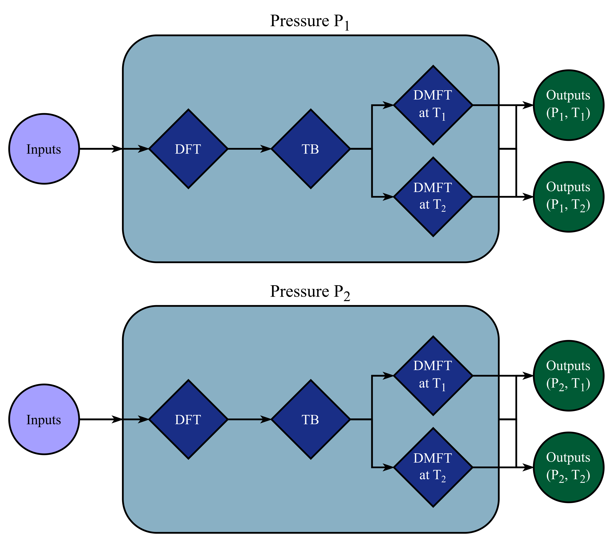
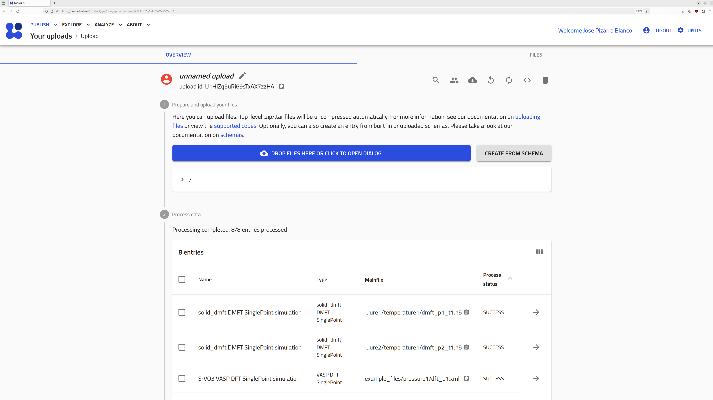
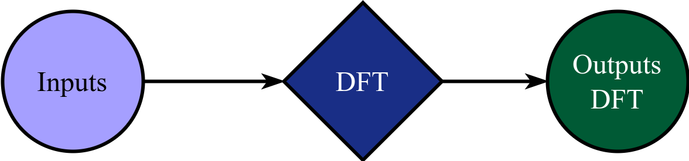
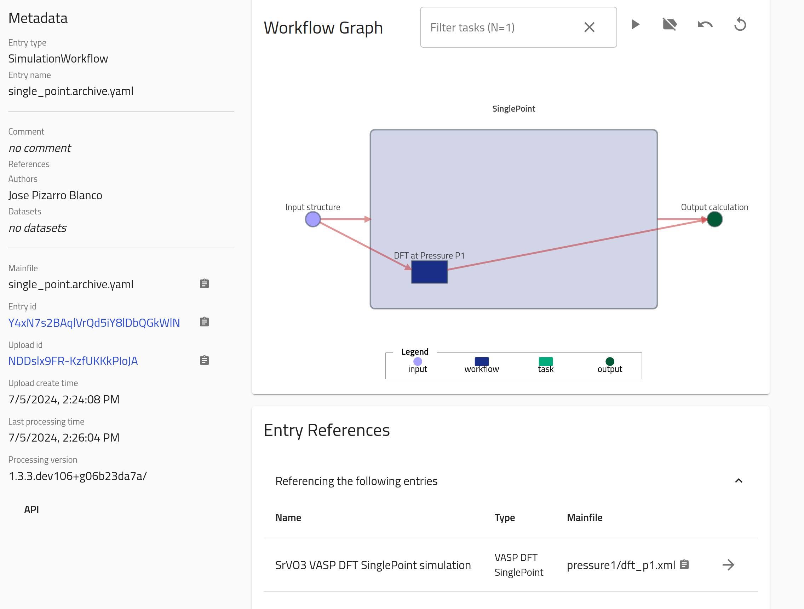
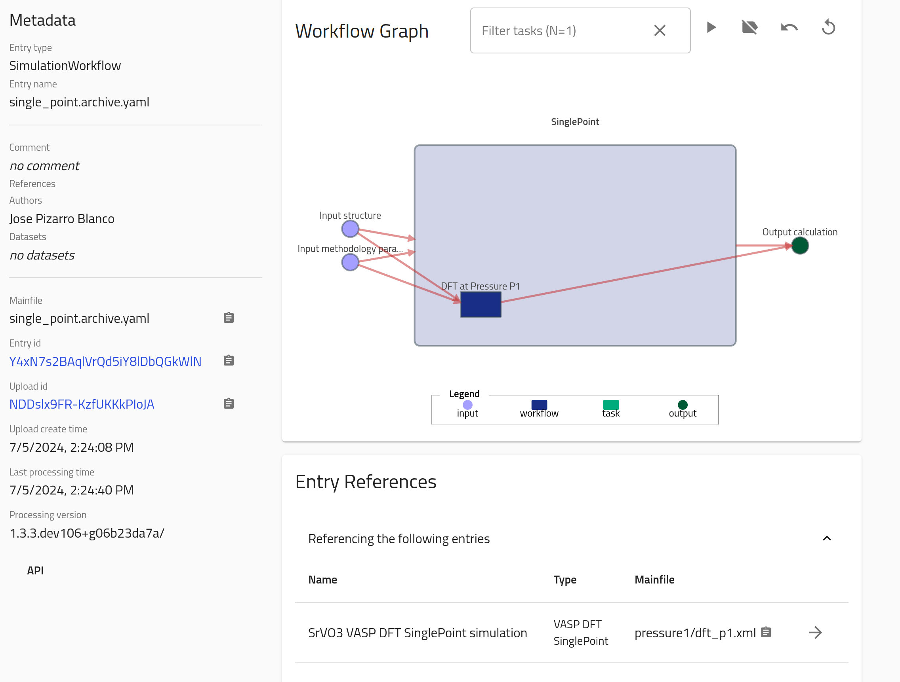
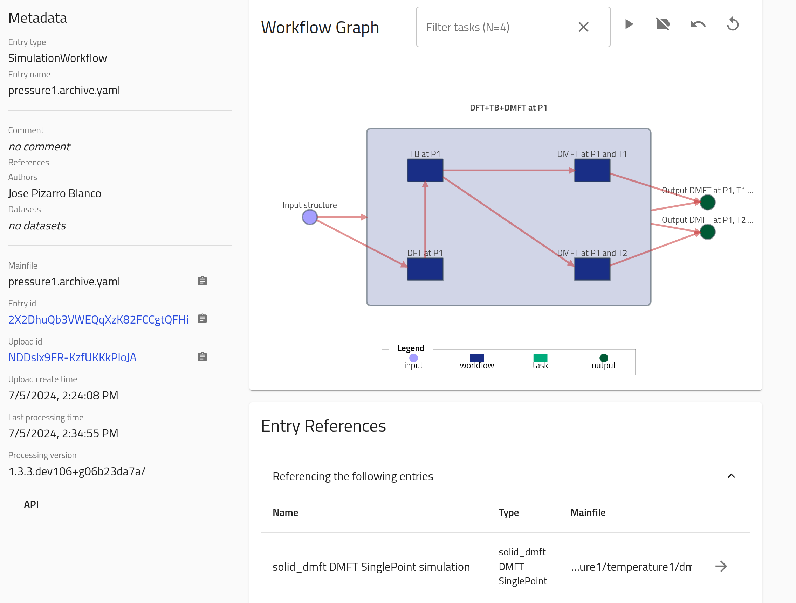
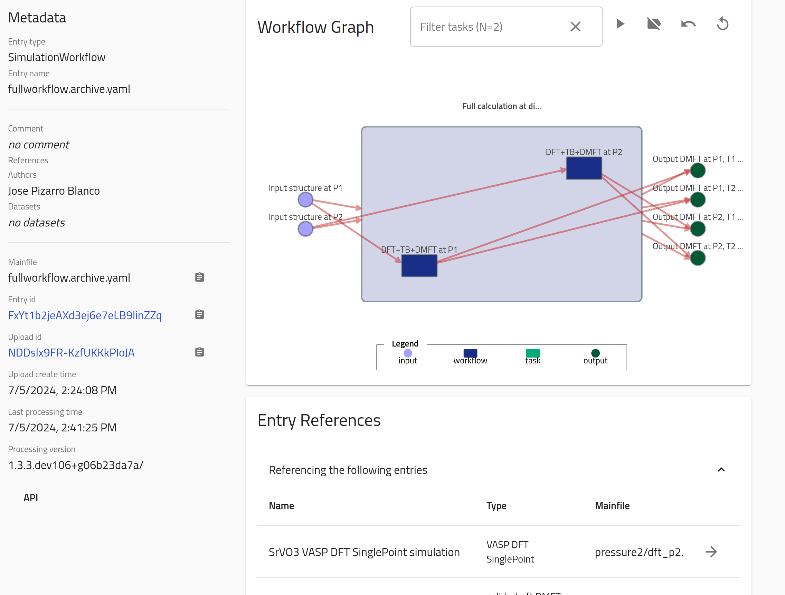

# Part V: Interfacing complex simulation and analysis workflows with NOMAD.

The concept of workflow is essential in simulations and analysis of Materials Science and Chemistry data. In NOMAD, we give support to workflows and understand them as a way of organizing data to keep the full provenance of an activity (either experimental or computational). Workflows can be also parsed in NOMAD in two slightly different ways: in an automatic way or by defining a custom workflow additional file. The first case is done when the simulation input and output files contain enough information to recognize a certain workflow, and it is typically done in the parser plugin. You can read more on how to prepare your input/output files to make this automatic recognition easier in the [Extra: Automatic workflows](#automaticworkflows) section at the end of this page.

This part of the Tutorial will show you the basic concepts of workflows in NOMAD, as well as how to define your own custom workflow. For that, we will use a ficticious example of a simulation workflow, where the [files and folder structure](https://www.fairmat-nfdi.eu/uploads/Area%20C/example_files.zip) is:
```
.
├── pressure1
│   ├── temperature1
│   │   ├── dmft_p1_t1.h5
│   │   └── ...extra auxiliary files
│   ├── temperature2
│   │   ├── dmft_p1_t2.h5
│   │   └── ...extra auxiliary files
│   ├── dft_p1.xml
│   ├── tb_p1.wout
│   └── ...extra auxiliary files
└── pressure2
    ├── temperature1
    │   ├── dmft_p2_t1.h5
    │   └── ...extra auxiliary files
    ├── temperature2
    │   ├── dmft_p2_t2.h5
    │   └── ...extra auxiliary files
    ├── dft_p2.xml
    ├── tb_p2.wout
    └── ...extra auxiliary files
```
Each of the files in this folder tree represents an electronic-structure calculation (either [DFT](https://en.wikipedia.org/wiki/Density_functional_theory), [TB](https://en.wikipedia.org/wiki/Tight_binding), or [DMFT](https://en.wikipedia.org/wiki/Dynamical_mean-field_theory)), which in turn is then parsed into a singular entry in NOMAD by matching and parsing the files as explained in [Part IV - Parser Plugins](parser_plugins.md). This folder structure presents a typical workflow calculation which can be represented as a provenance graph:

<div class="click-zoom">
    <label>
        <input type="checkbox">
        
    </label>
</div>

Note that the arrows here indicate directionality of the nodes _inputs_, _tasks_ (DFT, TB, DMFT), and _outputs_. Here, _input_ refers to the all input information given to perform the calculation. In [Part II - NOMAD-Simulations](nomad_simulations.md), we saw that the input is further divided in the `ModelSystem` information (i.e., atom positions, cell information, etc.) and the `ModelMethod` information (i.e., the mathematical model and numerical parameters). `DFT`, `TB` and `DMFT` refer to individual _tasks_ of the workflow, and refers to the activity [Simulation](nomad_simulations.md). _Output_ refers to the output data of each of the final DMFT tasks and is directly related with the `Outputs` section defined in [Part II - NOMAD-Simulations](nomad_simulations.md/#outputs).

Go to the [NOMAD Upload page](https://nomad-lab.eu/prod/v1/staging/gui/user/uploads), create a new upload, and drag-and-drop the zipped `example_files.zip` file. This action should generate 8 entries in total:

<div class="click-zoom">
    <label>
        <input type="checkbox">
        
    </label>
</div>

The assignements for this part of the tutorial are about setting manually the following workflows:

1. A `SinglePoint` workflow for one of the calculations (e.g., the DFT one) in the `pressure1` subfolder.
2. An overarching workflow entry for each pressure P<sub>i=1,2</sub>, grouping all `SinglePoint` DFT, TB, DMFT at T<sub>1</sub>, and DMFT at T<sub>2</sub> tasks.
3. A top level workflow entry, grouping together all pressure calculations.
4. Use or define a new plugin to run functionalities and normalizations for the custom workflows.

The solutions to these assignements can be found in the [Workflow YAML files](https://www.fairmat-nfdi.eu/uploads/Area%20C/workflowyaml_files.zip). We recommend you to try writing these files yourself first, and then compare them with the tested files.


## Assignement 5.1: `SinglePoint` workflow

NOMAD is able to [recognize certain workflows in an automatic way](#automaticworkflows), such as the `SinglePoint` case mentioned above. However, to showcase how to the use workflows in NOMAD, you will learn how to manually construct the `SinglePoint` workflow, represented by the following provenance graph:

<div class="click-zoom">
    <label>
        <input type="checkbox">
        
    </label>
</div>

To define a workflow manually in NOMAD, you must add a YAML file to the upload folder. This file contains references to the relevant inputs, outputs, and tasks sections. This file should be named `<filename>.archive.yaml`. In this case, you should include the file `single_point.archive.yaml` with the following content:

```yaml
workflow2:
  name: SinglePoint
  m_def: simulationworkflowschema.general.SimulationWorkflow
  inputs:
    - name: Input structure
      section: '../upload/archive/mainfile/pressure1/dft_p1.xml#/run/0/system/-1'
  outputs:
    - name: Output calculation
      section: '../upload/archive/mainfile/pressure1/dft_p1.xml#/run/0/calculation/-1'
  tasks:
    - m_def: nomad.datamodel.metainfo.workflow.TaskReference
      task: '../upload/archive/mainfile/pressure1/dft_p1.xml#/workflow2'
      name: DFT at Pressure P1
      inputs:
        - name: Input structure
          section: '../upload/archive/mainfile/pressure1/dft_p1.xml#/run/0/system/-1'
      outputs:
        - name: Output calculation
          section: '../upload/archive/mainfile/pressure1/dft_p1.xml#/run/0/calculation/-1'
```

Note several things about the content of this file:

1. **`name`** keys are optional.
2. **`m_def`** defines the section definition (in this case, the `SimulationWorkflow` section defined in the [simulationworkflowschema](https://github.com/nomad-coe/nomad-schema-plugin-simulation-workflow/blob/develop/simulationworkflowschema/general.py#L121) plugin and the `TaskReference` section defined in the source code of NOMAD) used for this workflow. This allows us to use the `normalize()` functions defined in this class. See [Assignement 5.4: Extending workflows plugins and `m_def` in the custom workflow schema](#assignement54) for more information
2. The root path of the upload can be referenced with `../upload/archive/mainfile/`. Starting from there, the original directory tree structure of the upload is maintained. There are other formats for referencing, and you can find more information on the corresponding [general NOMAD documentation](https://nomad-lab.eu/prod/v1/docs/howto/customization/basics.html#different-forms-of-references) page
3. **`inputs`** reference the section containing inputs of the whole workflow. In this case this is the section `run[0].system[-1]` parsed from the mainfile in the path `pressure1/dft_p1.xml`.
4. **`outputs`** reference the section containing outputs of the whole workflow. In this case this is the section `run[0].calculation[-1]` parsed from the mainfile in the path `pressure1/dft_p1.xml`.
5. **`tasks`** reference the section containing tasks of each step in the workflow. These must also contain `inputs` and `outputs` properly referencing the corresponding sections; this will then _link_ inputs/outputs/tasks in the NOMAD Archive. In this case this is a `TaskReference` to the section `workflow2` parsed from the mainfile in the path `pressure1/dft_p1.xml`.
6. **`section`** reference to the uploaded mainfile specific section. The left side of the `#` symbol contains the path to the mainfile, while the right contains the path to the section.

??? note "`run` and `data` sections in the NOMAD entries"
    As we explained in [Part I - Intro to NOMAD](intro.md), we are currently migrating the section definitions in `run` to `data`. In the [Part II - NOMAD-Simulations](nomad_simulations.md), we showed you the definitions that populate the `data` section. However, the current parsers in NOMAD still use the legacy section `run`, and that is why we need to still use references to these sections. Nevertheless, the structure of the legacy `run` schema and the new `data` schema is the same: in the legacy schema we had the `System` - `Method` - `Calculation` sub-sections, while in the new schema we have `ModelSystem` - `ModelMethod` - `Outputs`, and the very same reasoning will apply once we finish the migration.


Drag this new file into the upload we created. This will produce an extra entry with the following Overview content:

<div class="click-zoom">
    <label>
        <input type="checkbox">
        
    </label>
</div>

Note that you are referencing sections which are lists. Thus, in each case you should be careful to reference the correct section for inputs and outputs (example: a `GeometryOptimization` workflow calculation will have the "Input structure" as `run[0].system[0]`, while the "Output calculation" would also contain `run[0].system[-1]`, and all intermediate steps must input/output the corresponding section to be linked).

??? note "NOMAD workflow filename"
    The NOMAD workflow YAML file name, i.e., `<filename>` in the explanation above, can be any custom name defined by the user, but the file **must** keep the extension `.archive.yaml` at the end. This is done in order for NOMAD to recognize this file as a custom schema. Custom schemas are widely used in experimental parsing, and you can learn more about them in the [FAIRmat tutorial 8](https://www.fairmat-nfdi.eu/events/fairmat-tutorial-8/tutorial-8-home).

You can extend the workflow meta-information by adding the metholodogical input parameters as stored in the section path `run[0].method[-1]`. The new `single_point.archive.yaml` will be:

```yaml
workflow2:
  name: SinglePoint
  m_def: simulationworkflowschema.general.SimulationWorkflow
  inputs:
    - name: Input structure
      section: '../upload/archive/mainfile/pressure1/dft_p1.xml#/run/0/system/-1'
    - name: Input methodology parameters
      section: '../upload/archive/mainfile/pressure1/dft_p1.xml#/run/0/method/-1'
  outputs:
    - name: Output calculation
      section: '../upload/archive/mainfile/pressure1/dft_p1.xml#/run/0/calculation/-1'
  tasks:
    - m_def: nomad.datamodel.metainfo.workflow.TaskReference
      task: '../upload/archive/mainfile/pressure1/dft_p1.xml#/workflow2'
      name: DFT at Pressure P1
      inputs:
        - name: Input structure
          section: '../upload/archive/mainfile/pressure1/dft_p1.xml#/run/0/system/-1'
        - name: Input methodology parameters
          section: '../upload/archive/mainfile/pressure1/dft_p1.xml#/run/0/method/-1'
      outputs:
        - name: Output calculation
          section: '../upload/archive/mainfile/pressure1/dft_p1.xml#/run/0/calculation/-1'
```

which in turn produces a similar workflow than before, but with an extra input node:

<div class="click-zoom">
    <label>
        <input type="checkbox">
        
    </label>
</div>


## Assignement 5.2: Pressure workflows

Now that you know the basics of the workflow YAML schema, let's try to define an overarching workflow for each of the pressures. For this section, you will learn how to create the workflow YAML schema for the P<sub>1</sub> case; the extension for P<sub>2</sub> is then a matter of changing names and paths in the YAML files. For simplicity, we will skip referencing to methodology sections.

Thus, the `inputs` can be defined as:
```yaml
workflow2:
  name: DFT+TB+DMFT at P1
  m_def: simulationworkflowschema.general.SimulationWorkflow
  inputs:
    - name: Input structure
      section: '../upload/archive/mainfile/pressure1/dft_p1.xml#/run/0/system/-1'
```
and there are two `outputs`, one for each of the DMFT calculations at distinct temperatures:
```yaml
  outputs:
    - name: Output DMFT at P1, T1 calculation
      section: '../upload/archive/mainfile/pressure1/temperature1/dmft_p1_t1.h5#/run/0/calculation/-1'
    - name: Output DMFT at P1, T2 calculation
      section: '../upload/archive/mainfile/pressure1/temperature2/dmft_p1_t2.h5#/run/0/calculation/-1'
```
Now, `tasks` are defined for each of the activities performed (each corresponding to an underlying SinglePoint workflow). To define a linked workflow as it is the case, each task must contain an input that corresponds to one of the outputs of the previous task. Moreover, the first task should take as input the overall input of the workflow, and the final task should also have as an output the overall workflow output.
Then:
```yaml
  tasks:
    - m_def: nomad.datamodel.metainfo.workflow.TaskReference
      task: '../upload/archive/mainfile/pressure1/dft_p1.xml#/workflow2'
      name: DFT at P1
      inputs:
        - name: Input structure
          section: '../upload/archive/mainfile/pressure1/dft_p1.xml#/run/0/system/-1'
      outputs:
        - name: Output DFT at P1 calculation
          section: '../upload/archive/mainfile/pressure1/dft_p1.xml#/run/0/calculation/-1'
    - m_def: nomad.datamodel.metainfo.workflow.TaskReference
      task: '../upload/archive/mainfile/pressure1/tb_p1.wout#/workflow2'
      name: TB at P1
      inputs:
        - name: Input DFT at P1 calculation
          section: '../upload/archive/mainfile/pressure1/dft_p1.xml#/run/0/calculation/-1'
      outputs:
        - name: Output TB at P1 calculation
          section: '../upload/archive/mainfile/pressure1/tb_p1.wout#/run/0/calculation/-1'
    - m_def: nomad.datamodel.metainfo.workflow.TaskReference
      task: '../upload/archive/mainfile/pressure1/temperature1/dmft_p1_t1.h5#/workflow2'
      name: DMFT at P1 and T1
      inputs:
        - name: Input TB at P1 calculation
          section: '../upload/archive/mainfile/pressure1/tb_p1.wout#/run/0/calculation/-1'
      outputs:
        - name: Output DMFT at P1, T1 calculation
          section: '../upload/archive/mainfile/pressure1/temperature1/dmft_p1_t1.h5#/run/0/calculation/-1'
    - m_def: nomad.datamodel.metainfo.workflow.TaskReference
      task: '../upload/archive/mainfile/pressure1/temperature1/dmft_p1_t1.h5#/workflow2'
      name: DMFT at P1 and T2
      inputs:
        - name: Input TB at P1 calculation
          section: '../upload/archive/mainfile/pressure1/tb_p1.wout#/run/0/calculation/-1'
      outputs:
        - name: Output DMFT at P1, T2 calculation
          section: '../upload/archive/mainfile/pressure1/temperature2/dmft_p1_t2.h5#/run/0/calculation/-1'
```
Note here:

- The `inputs` for each subsequent step are the `outputs` of the previous step.
- The final two `outputs` coincide with the `workflow2` `outputs`.

This workflow (`pressure1.archive.yaml`) file will then produce an entry with the following Overview page:

<div class="click-zoom">
    <label>
        <input type="checkbox">
        
    </label>
</div>

Similarly, for P<sub>2</sub> you can upload a new `pressure2.archive.yaml` file with the same content, except when substituting 'pressure1' and 'p1' by their counterparts. This will produce a similar graph than the one showed before but for "P2".


## Assignement 5.3: The top-level workflow

After adding the workflow YAML files, Your upload folder directory now looks like:
```
.
├── pressure1
│   │   ├── dmft_p1_t1.h5
│   │   └── ...extra auxiliary files
│   ├── temperature2
│   │   ├── dmft_p1_t2.h5
│   │   └── ...extra auxiliary files
│   ├── dft_p1.xml
│   ├── tb_p1.wout
│   └── ...extra auxiliary files
├── pressure1.archive.yaml
├── pressure2
│   ├── temperature1
│   │   ├── dmft_p2_t1.h5
│   │   └── ...extra auxiliary files
│   ├── temperature2
│   │   ├── dmft_p2_t2.h5
│   │   └── ...extra auxiliary files
│   ├── dft_p2.xml
│   ├── tb_p2.wout
│   └── ...extra auxiliary files
├── pressure2.archive.yaml
└── single_point.archive.yaml
```
In order to define the general workflow that groups all pressure calculations, you can reference directly the previous `pressure1.archive.yaml` and `pressure2.archive.yaml` files as tasks. Still, `inputs` and `outputs` must be referenced to their corresponding file and section paths.

Create a new `fullworkflow.archive.yaml` file with the `inputs`:
```yaml
workflow2:
  name: Full calculation at different pressures for SrVO3
  m_def: simulationworkflowschema.general.SimulationWorkflow
  inputs:
    - name: Input structure at P1
      section: '../upload/archive/mainfile/pressure1/dft_p1.xml#/run/0/system/-1'
    - name: Input structure at P2
      section: '../upload/archive/mainfile/pressure2/dft_p2.xml#/run/0/system/-1'
```
And `outputs`:
```yaml
  outputs:
    - name: Output DMFT at P1, T1 calculation
      section: '../upload/archive/mainfile/pressure1/temperature1/dmft_p1_t1.h5#/run/0/calculation/-1'
    - name: Output DMFT at P1, T2 calculation
      section: '../upload/archive/mainfile/pressure1/temperature2/dmft_p1_t2.h5#/run/0/calculation/-1'
    - name: Output DMFT at P2, T1 calculation
      section: '../upload/archive/mainfile/pressure2/temperature1/dmft_p2_t1.h5#/run/0/calculation/-1'
    - name: Output DMFT at P2, T2 calculation
      section: '../upload/archive/mainfile/pressure2/temperature2/dmft_p2_t2.h5#/run/0/calculation/-1'
```
Finally, `tasks` references the previous YAML schemas as follows:
```yaml
  tasks:
    - m_def: nomad.datamodel.metainfo.workflow.TaskReference
      task: '../upload/archive/mainfile/pressure1.archive.yaml#/workflow2'
      name: DFT+TB+DMFT at P1
      inputs:
        - name: Input structure at P1
          section: '../upload/archive/mainfile/pressure1/dft_p1.xml#/run/0/system/-1'
      outputs:
        - name: Output DMFT at P1, T1 calculation
          section: '../upload/archive/mainfile/pressure1/temperature1/dmft_p1_t1.h5#/run/0/calculation/-1'
        - name: Output DMFT at P1, T2 calculation
          section: '../upload/archive/mainfile/pressure1/temperature2/dmft_p1_t2.h5#/run/0/calculation/-1'
    - m_def: nomad.datamodel.metainfo.workflow.TaskReference
      task: '../upload/archive/mainfile/pressure2.archive.yaml#/workflow2'
      name: DFT+TB+DMFT at P2
      inputs:
        - name: Input structure at P2
          section: '../upload/archive/mainfile/pressure2/dft_p2.xml#/run/0/system/-1'
      outputs:
        - name: Output DMFT at P2, T1 calculation
          section: '../upload/archive/mainfile/pressure2/temperature1/dmft_p2_t1.h5#/run/0/calculation/-1'
        - name: Output DMFT at P2, T2 calculation
          section: '../upload/archive/mainfile/pressure2/temperature2/dmft_p2_t2.h5#/run/0/calculation/-1'
```

This will produce the following entry and its Overview page:

<div class="click-zoom">
    <label>
        <input type="checkbox">
        
    </label>
</div>


## Assignement 5.4: Extending workflows plugins and `m_def` in the custom workflow schema {#assignement54}

In the previous assignements, you learn how to define your own workflows. An important step in the definition of this YAML files is the specification of `m_def`. This key allows us automate calls for the `normalize()` function of the specified class (in all the examples above, these were `SimulationWorkflow` and `TaskReference`). This means we can extract more information from this workflows if `m_def` is defined as a standard workflow section, e.g., `SinglePoint` or `GeometryOptimization`.

??? note "Current status of standard workflow definitions"
    We are currently working on extending the support for a large variety of standard workflows. As of July 2024, we have the `nomad-simulations` and the `simulationworkflowschema` plugins living in two separate Github repositories, but we are planning to merge both plugins into the `nomad-simulations` package. In order to see the current supported standard workflows, we recommend you to visit the [simulationworkflowschema](https://github.com/nomad-coe/nomad-schema-plugin-simulation-workflow/tree/develop/simulationworkflowschema) plugin and check its modules.


In our previous example, we can standardize the definition of the `single_point.archive.yaml` by changing `m_def` to point to the standard `SinglePoint` workflow:
```yaml
workflow2:
  name: SinglePoint
  m_def: simulationworkflowschema.single_point.SinglePoint
  inputs:
    - name: Input structure
      section: '../upload/archive/mainfile/pressure1/dft_p1.xml#/run/0/system/-1'
    - name: Input methodology parameters
      section: '../upload/archive/mainfile/pressure1/dft_p1.xml#/run/0/method/-1'
  outputs:
    - name: Output calculation
      section: '../upload/archive/mainfile/pressure1/dft_p1.xml#/run/0/calculation/-1'
  tasks:
    - m_def: nomad.datamodel.metainfo.workflow.TaskReference
      task: '../upload/archive/mainfile/pressure1/dft_p1.xml#/workflow2'
      name: DFT at Pressure P1
      inputs:
        - name: Input structure
          section: '../upload/archive/mainfile/pressure1/dft_p1.xml#/run/0/system/-1'
        - name: Input methodology parameters
          section: '../upload/archive/mainfile/pressure1/dft_p1.xml#/run/0/method/-1'
      outputs:
        - name: Output calculation
          section: '../upload/archive/mainfile/pressure1/dft_p1.xml#/run/0/calculation/-1'
```

This has no practical effect, but it actually shows that if new methods/class functions are implemented in `SinglePoint` and called in `SinglePoint.normalize()` we could extract more information into the workflow entry and even display some derived properties.


## Extra: Automatic workflows {#automaticworkflows}

There are some cases where the NOMAD infrastructure is able to recognize certain workflows automatically when processing the uploaded files. The simplest example is any `SinglePoint` calculation, as explained above. Other examples include `GeometryOptimization`, `Phonons`, `DFT+GW`, and `MolecularDynamics`. Automated workflow detection may require your folder structure to fulfill certain conditions.

Here are some general guidelines or suggestions for preparing your upload folder in order to make it easier for the automatic workflow recognition to work:

- Always organize your files in an **top-down structure**, i.e., the initial tasks should be upper in the directory tree, while the later tasks lower on it.
- Avoid having to go up and down between folders if some properties are derived between these files. These situations are very complicated to predict a priori in an automatic way.
- Keep as much information as possible regarding relative file paths, tasks, etc, in the output of your simulations.
- Avoid duplication of files in subfolders. If initially you do a simulation A from which a later simulation B is derived and you want to store B in a subfolder, there is no need to copy the A files inside the subfolder B.

The folder structure used throughout this part is a good example of a clean upload which is friendly and easy to work with when defining NOMAD workflows.
