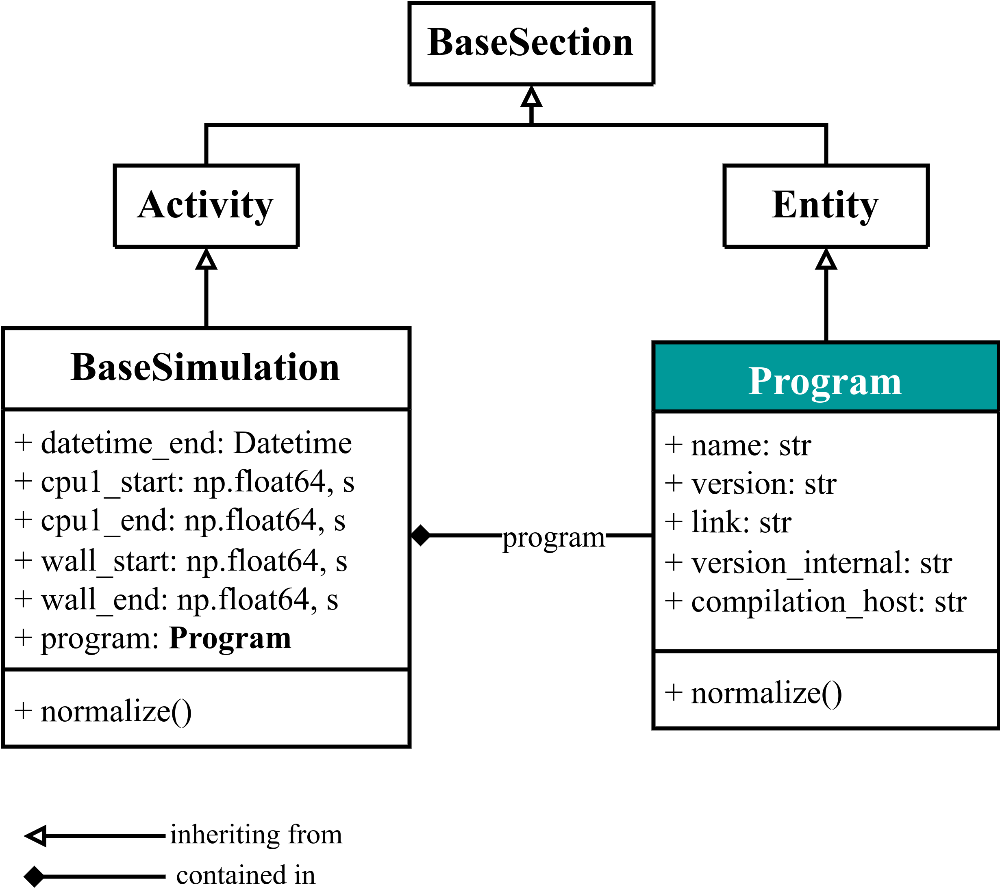
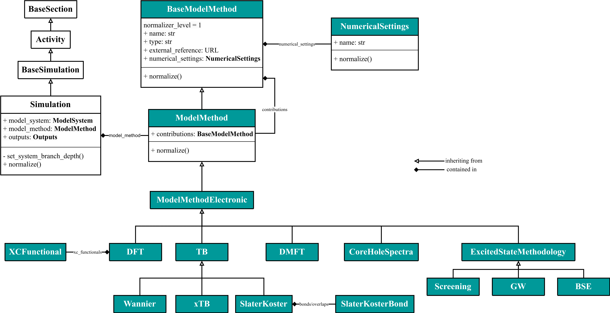
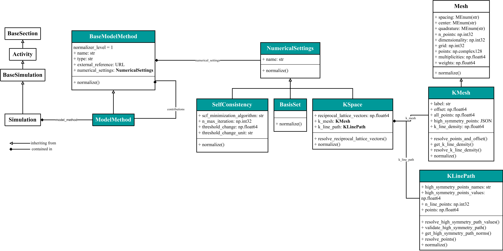
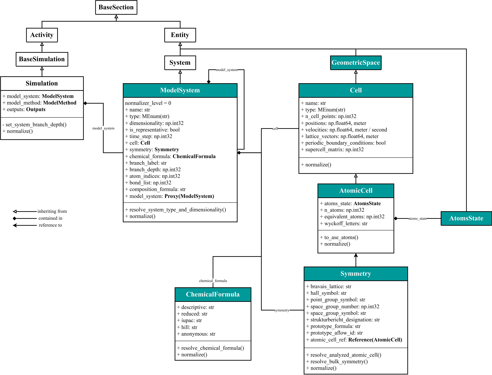
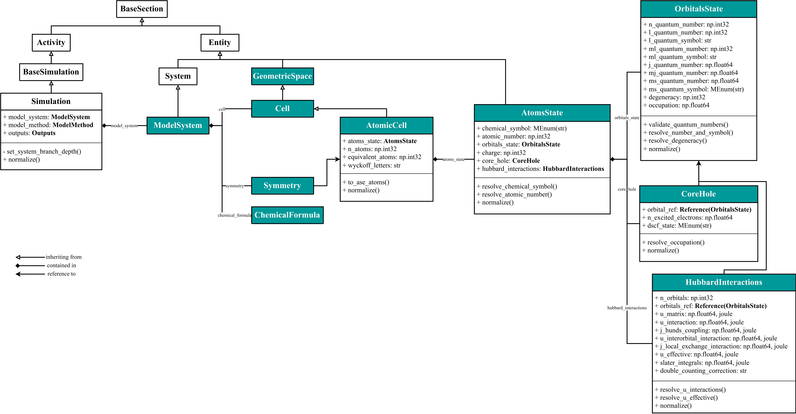
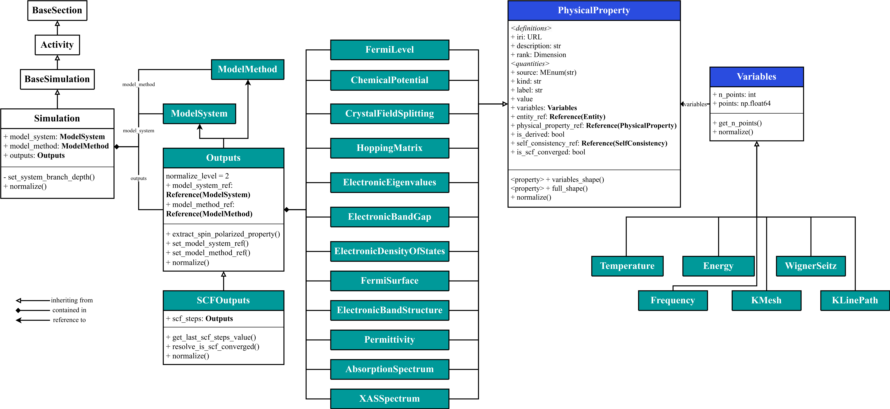

# Working with the NOMAD-Simulations schema plugin

In NOMAD, all the simulation metadata is defined under the `Simulation` section. You can find its Python schema defined in the [`nomad-simulations`](https://github.com/nomad-coe/nomad-simulations/) repository. The entry point for the schema is in the [general.py](https://github.com/nomad-coe/nomad-simulations/blob/develop/src/nomad_simulations/schema_packages/general.py) module. This section will appear under the `data` section for each NOMAD [*entry*](https://nomad-lab.eu/prod/v1/staging/docs/reference/glossary.html#entry). There is a [specialized documentation page](https://nomad-coe.github.io/nomad-simulations/) in the `nomad-simulations` repository.

The `Simulation` section inherits from a more abstract class or concept called `BaseSimulation`, which at the same time inherits from another class, `Activity`. 

??? note "Inheritance and composition"
    During this part, we will identify the **is a** concept with inheritance of one class into another (e.g., a `Simulation` _is an_ `Activity`) and the **has a** concept with composition of one class under another (e.g., a `Simulation` **has a** `ModelSystem` defined under it and on which the simulation is performed). Strictly speaking, this equivalency is not entirely true, as we are loosing it in some cases. But for the purpose of learning the complicated rules of inheritance and composition, we will conceptually maintain this equivalency during this Tutorial.

In NOMAD, a set of [base sections](https://nomad-lab.eu/prod/v1/staging/docs/howto/customization/base_sections.html) derived from the [Basic Formal Ontology (BFO)](https://basic-formal-ontology.org/) are defined. The previous inheritance allows us to define `Simulation` at the same level of other activities in Materials Science, e.g., `Experiment`, `Measurement`, `Analysis`. We do this in order to achieve a common metadata structure with the experimental community. The relationship tree from the most abstract classes until `Simulation` is thus:

<div class="click-zoom">
    <label>
        <input type="checkbox">
        
    </label>
</div>

Note that the white-headed arrow here indicates _inheritance_ / _is a_ relationship. `BaseSimulation` contains the general information about the `Program` used (see [Program](#program)), as well as general times of the simulation, e.g., the datetime at which it started (`datetime` is defined in `Activity` and inherit for `BaseSimulation`) and ended (`datetime_end`). `Simulation` contains further information about the specific input and output sections ([see below](#sub-sections-in-simulation)).

??? question "Notation for the section attributes in the UML diagram"
    We included the information of each attributes / quantities after its definition. The notation is:

        <name-of-quantity>: <type-of-quantity>, <(optional) units-of-quantity>

    Thus, `cpu1_start: np.float64, s` means that there is a quantity named `'cpu1_start'` of type `numpy.float64` and whose units are `'s'` (seconds).
    We also include the existance of sub-sections by bolding the name, i.e.:

        <name-of-sub-section>: <sub-section-definition>

    E.g., there is a sub-section under `Simulation` named `'model_method'` whose section defintion can be found in the `ModelMethod` section. We will represent this sub-section containment in more complex UML diagrams in the future using the containment arrow (see below for the specific ase of [`Program`](#program)).

We use double inheritance from `EntryData` in order to populate the `data` section in the NOMAD archive. All of the base sections discussed here are subject to the [public normalize function](normalize.md) in NOMAD. The private function `set_system_branch_depth()` is related with the [ModelSystem base section](model_system/model_system.md).

!!! abstract "Assignement 2.1"
    Create a new directory and a new virtual environment within it, activate the environment, and install the `nomad-simulations` package. Once this is done, create an instance of the section `Simulation`. Imagine you know that the CPU1 took 24 minutes and 30 seconds on finishing the simulation; can you parse that elapsed time into the section `Simulation`? What is the elapsed time in seconds? And in hours?

??? success "Solution 2.1"
    First, we will create the directory and the virtual environment; remember that the Python version must be 3.9 for `nomad-simulations` to work:
    ```sh
    mkdir test_nomadsimulations
    cd test_nomadsimulations/
    python3.9 -m venv .pyenv
    source .pyenv/bin/activate
    ```
    
    Once this is done, we can pip install the `nomad-simulations` package:
    ```sh
    pip install --upgrade pip
    pip install nomad-simulations --index-url https://gitlab.mpcdf.mpg.de/api/v4/projects/2187/packages/pypi/simple
    ```

    We can open a Python console:
    ```sh
    python
    ```

    And import and instantiate the section `Simulation`:
    ```python
    from nomad_simulations.schema_packages.general import Simulation
    simulation = Simulation()
    ```

    Now, we can assign the elapsed time of the CPU1 by defining the start and the end quantities, i.e., `cpu1_start` and `cpu1_end`. Due to the units, we need to also import the Pint utility class `ureg`:
    ```python
    from nomad.units import ureg
    simulation.cpu1_start = 0 * ureg.second
    simulation.cpu1_end = 30 * ureg.second + 24 * ureg.minute
    ```

    In seconds, the elapsed time can be printed by doing:
    ```python
    simulation.cpu1_end - simulation.cpu1_start
    ```
    which is 1470 seconds. In hours, we can use the method `to('hour')`:
    ```python
    (simulation.cpu1_end - simulation.cpu1_start).to('hour')
    ```
    which give us approximately 0.4083 hours.


## Main sub-sections in `Simulation` {#sub-sections-in-simulation}

The `Simulation` section is composed of 4 main sub-sections:

1. [`Program`](#program): contains all the program metadata, e.g., `name` of the program, `version`, etc.
2. [`ModelSystem`](#modelsystem): contains all the system metadata about geometrical positions of atoms, their states, simulation cells, symmetry information, etc.
3. [`ModelMethod`](#modelmethod): contains all the methodological metadata, and it is divided in two main aspects: the mathematical model or approximation used in the simulation (e.g., `DFT`, `GW`, `ForceFields`, etc.) and the numerical settings used to compute the properties (e.g., meshes, self-consistent parameters, basis sets settings, etc.).
4. [`Outputs`](#outputs): contains all the output properties obtained by the `Simulation`.

!!! note "Self-consistent steps, SinglePoint entries, and more complex workflows."
    The minimal unit for storing data in the NOMAD archive is an [*entry*](https://nomad-lab.eu/prod/v1/staging/docs/reference/glossary.html#entry). In the context of simulation data, an entry may contain data from a calculation on an individual system configuration (e.g., a single-point DFT calculation) using **only** the above-mentioned sections of the `Simulation` section. Information from self-consistent iterations to converge properties for this configuration are also contained within these sections.

    More complex calculations that involve multiple configurations require the definition of a *workflow* section within the archive. Depending on the situation, the information from individual workflow steps may be stored within a single or multiple entries. For example, for efficiency, the data from workflows involving a large amount of configurations, e.g., molecular dynamics trajectories, are stored within a single entry. Other standard workflows store the single-point data in separate entries, e.g.,  a `GW` calculation is composed of a `DFT SinglePoint` entry and a `GW SinglePoint` entry. Higher-level workflows, which simply connect a series of standard or custom workflows, are typically stored as a separate entry.
<!--Mention here Part V?-->

The following schematic represents a simplified representation of the `Simulation` section (note that the arrows here are a simple way of visually defining _inputs_ and _outputs_):

<div class="click-zoom">
    <label>
        <input type="checkbox">
        
    </label>
</div>

## `Program` {#program}

The `Program` section contains all the information about the program / software / code used to perform the simulation. The detailed relationship tree is:

<div class="click-zoom">
    <label>
        <input type="checkbox">
        
    </label>
</div>

Note that the rhombo-headed arrow here indicates a _composition_ / _has a_ relationship, so that `BaseSimulation` has a `Program` sub-section under it.

!!! abstract "Assignement 2.2"
    Instantiate a section `Program` assigning directly the name `'VASP'` and the version `'5.0.0'`. Add this sub-section to the section `Simulation` created in the Assignement 2.1. Can you re-assign the `Program.version` quantity to be an integer number, 5?

??? success "Solution 2.2"
    We can import and assign directly quantities of sections by doing:
    ```python
    from nomad_simulations.schema_packages.general import Program
    program = Program(name='VASP', version='5.0.0')
    ```

    And we can add it as a sub-section of `Simulation` by simply assigning the attribute of that class:
    ```python
    simulation.program = program
    ```

    If we try to re-assign:
    ```python
    program.version = 5
    ```
    the code will complain with a `TypeError`:
    ```sh
    TypeError: The value 5 with type <class 'int'> for quantity nomad_simulations.schema_packages.general.Program.version:Quantity is not of type <class 'str'>
    ```
    This is because in the defintion of the `class Program` and the `Quantity` version, we define the type to be a string. So answering the question: no, it is not possible to re-assign `version` to be an integer due to the fact that is defined to be a string.


## `ModelMethod` {#modelmethod}

The `ModelMethod` section is an input section which contains all the information about the mathematical model used to perform the simulation. In NOMAD, we can extend the support of certain methods by inheriting from `ModelMethod` and extend the schema for the new methodology. `ModelMethod` also contains a specialized sub-section called [`NumericalSettings`](#numericalsettings). The detailed relationship tree is:

<div class="click-zoom">
    <label>
        <input type="checkbox">
        
    </label>
</div>

`ModelMethod` is thus a sub-section under `Simulation`. It inherits from an abstract class `BaseModelMethod`, as well as containing a sub-section called `contributions` of the same class. The underlying idea of `ModelMethod` is to parse the input parameters of the mathematical model, typically a Hamiltonian. This total Hamiltonian or model could be splitted into individual terms or `contributions`. Each of the electronic-structure methodologies inherits from `ModelMethodElectronic` that contains a boolean `is_spin_polarized` which indicates if the `Simulation` is spin polarized or not. The different levels of abstractions are useful when dealing with commonalities amongst the methods. 

!!! abstract "Assignement 2.3"
    Instantiate a section `DFT`. For simplicity, you can also assign the `jacobs_ladder` quantity to be `'LDA'`. Add this sub-section to the section `Simulation` created in the Assignement 2.1. What is the underlying concept that allows you to add directly the `class DFT` under `Simulation.model_method`, provided that the definition of this attribute is a sub-section `ModelMethod`? Can you reason why the current schema (July 2024) is inconsistent in handling the `xc_functionals` contributions?

??? success "Solution 2.3"
    Similarly to Assignement 2.2, we can import and create the class `DFT`:
    ```python
    from nomad_simulations.schema_packages.model_method import DFT
    dft = DFT(jacobs_ladder='LDA')
    ```

    This time, due to the fact that `Simulation.model_method` is a repeating sub-section (i.e., a list of sub-sections), we need to append `dft` instead of directly assigning the attribute:
    ```python
    simulation.model_method.append(dft)
    ```

    Thanks to inheritance of `class DFT` with `ModelMethod` and polymorphism, we can directly append `dft` as a `model_method` sub-section as both classes are directly related with "is a"-type of relationship.

    The current schema is also a bit inconsistent due to the fact that `BaseModelMethod` has a sub-section called `contributions`, while `DFT` has also a sub-section called `xc_functionals`, hence both sub-sections live at the same time under the section `DFT`. Conceptually, both sub-sections are the same: they refer to a sub-term or contribution of the total DFT Hamiltonian, thus, their definitions should be combined and only one sub-section should be used. The best action here would be to open an issue in the `nomad-simulations` Github repository, or directly contact the maintainers.


### `NumericalSettings` {#numericalsettings}

The `NumericalSettings` section is an abstract section used to define the numerical parameters set during the simulation, e.g., the plane-wave basis cutoff used, the k-mesh, etc. These parameters can be defined into specialized classes which inherit from `NumericalSettings` (similar to what happens with all the electronic-structure methodologies and `ModelMethod`). The detailed relationship tree is:

<div class="click-zoom">
    <label>
        <input type="checkbox">
        
    </label>
</div>

!!! abstract "Assignement 2.4"
    Instantiate a section `SelfConsistency` and assign the quantity `threshold_change` to be `1e-3` and the `threshold_change_unit` to be `'joule'`. Add this sub-section to `DFT` created in the Assignement 2.3. Is the new information also stored in the section `Simulation` created in Assignement 2.1? Can you access the information of the Jacobs ladder string used in this simulation **starting** from the newly instantiated class?

??? success "Solution 2.4"
    We can import and create the class `SelfConsistency`, assign the specified quantities, and append it under `dft`:
    ```python
    from nomad_simulations.schema_packages.numerical_settings import SelfConsistency
    scf = SelfConsistency(threshold_change=1e-3, threshold_change_unit='joule')
    dft.numerical_settings.append(scf)
    ```

    In order to see if `scf` is showing directly under `simulation`, we can:
    ```python
    simulation.model_method[0].numerical_settings
    ```
    which indeed returns:
    ```sh
    [SelfConsistency:SelfConsistency(name, threshold_change, threshold_change_unit)]
    ```

    In order to go from `scf` to the `dft.jacobs_ladder` information, we can use the method `m_parent`:
    ```python
    scf.m_parent.jacobs_ladder
    ```
    which will return:
    ```sh
    'LDA'
    ```

## `ModelSystem` {#modelsystem}

The `ModelSystem` section is an input section which contains all the information about the geometrical space quantities (positions, lattice vectors, volumes, etc) of the simulated system. This section contains various quantities and sub-sections which aim to describe the system in the most complete way and in a variety of cases, from unit cells of crystals and molecules up to microstructures. In order to handle this _hierarchical_ structure, `ModelSystem` is nested over itself, i.e., a `ModelSystem` can be composed of sub-systems, which at the same time could be composed of smaller sub-systems. This is done thanks to the (proxy) sub-section attribute called `model_system`.

The `Cell` sub-section is an important class which contains information of the simulated cell. It does not necessarily contain the information of the elements sitting in each `positions`, as this is responsability of a more specialized class, the `AtomicCell`. This class contains information about the atoms conforming the material in the section [`AtomsState`](#atomsstate). The sub-section `Symmetry` contains information about the symmetry of the system, and the sub-section `ChemicalFormula` contains the strings that allow the system to be identified in a specific format of the chemical formulas (IUPAC, Hill, etc).

The detailed relationship tree is:

<div class="click-zoom">
    <label>
        <input type="checkbox">
        
    </label>
</div>

The abstract section `Entity` is defined in the [Basic Formal Ontology (BFO)](https://basic-formal-ontology.org/) as a continuant entity, and we use it to abstract our `ModelSystem` using the intermediate base section `System`. This base section, `System`, is also used by the experimental data models.

??? note "GeometricSpace and simulated cells."
    The abstract section `GeometricSpace` is used to define more general real space quantities related with the system of reference used, areas, lengths, volumes, etc. However, this section and `Cell` is currently under revision and will probably change in the near future.


### `AtomsState` and other sub-sections {#atomsstate}

The `AtomsState` section is a sub-section of `AtomicCell` containing information about the specific chemical element used in the simulation and sitting in each of the `positions` defined under `Cell`. It also contains information about the relevant `OrbitalsState`, as well as if there is other information on `CoreHole` or `HubbardInteractions`. The detailed relationship tree is:

<div class="click-zoom">
    <label>
        <input type="checkbox">
        
    </label>
</div>


!!! abstract "Assignement 2.5"
    Instantiate two sections `AtomsState` and assign the `chemical_symbol` to be `'Ga'` and `'As'` for each of the sections. In this case, we also need to define a `logger` object in order for the functionalities to work:
    ```python
    from nomad import utils
    logger = utils.get_logger(__name__)
    ```
    Using a method of both sections `AtomsState`, what is the atomic number of Ga and of As?

??? success "Solution 2.5"
    We can import and create two instances of `AtomsState` and assign `chemical_symbol` in a variety of ways. In this case, we chose to create a loop and append the sections to a list `atoms_states`:
    ```python
    from nomad_simulations.schema_packages.atoms_state import AtomsState
    atoms_states = [AtomsState(chemical_symbol=element) for element in ['Ga', 'As']]
    ```

    For each of the atoms, we can use the class method `resolve_atomic_number(logger)` which will directly return the atomic number of each section:
    ```python
    [atom.resolve_atomic_number(logger=logger) for atom in atoms_states]
    ```
    which returns:
    ```sh
    [31, 33]
    ```
    Hence, the atomic number of Ga is 31 and of As is 33.


!!! abstract "Assignement 2.6"
    Instantiate a section `ModelSystem` and a section `AtomicCell`. Assign the `positions` in the atomic cell to be `[[0, 0, 0], [1, 1, 1]]` in meters. Add the `atoms_states` defined in the Assignement 2.5 under the `AtomicCell` section. Append `ModelSystem` to the `Simulation` section created in Assignement 2.1.

    Now, we want to extract the different formats in which the chemical formulas of this system can be written. For that, assign directly the sub-section `ChemicalFormula` under `ModelSystem`. Note: you can use the `ChemicalFormula.normalize(archive, logger)` method, and pass `archive=None` to this function.

    What are the different formats of the chemical formula? What is the string of the `descriptive` format and why it coincides with other format(s) in the sub-section? 

??? success "Solution 2.6"
    We can import and create instances of `ModelSystem` and `AtomicCell` and assign the corresponding quantities directly: 
    ```python
    from nomad_simulations.schema_packages.model_system import ModelSystem, AtomicCell
    model_system = ModelSystem()
    atomic_cell = AtomicCell(atoms_state=atoms_states, positions=[[0, 0, 0], [1, 1, 1]] * ureg.meter)
    model_system.cell.append(atomic_cell)
    ```

    We can append this section to `Simulation`:
    ```python
    simulation.model_system.append(model_system)
    ``` 

    We can now assign directly an empty section `ChemicalFormula` to `ModelSystem`, in order to be able to call for the specific class method:
    ```python
    from nomad_simulations.schema_packages.model_system import ChemicalFormula
    model_system.chemical_formula = ChemicalFormula()
    ```

    In order to extract the formulas and assign them to the quantities of the section `ChemicalFormula`, we can use the method `normalize()`. This class method takes two arguments as inputs: `archive` and `logger`. For the purpose of this tutorial, we can set `archive=None`:
    ```python
    model_system.chemical_formula.normalize(archive=None, logger=logger)
    ```

    Now, the sub-section `ChemicalFormula` contains the information of the different formats for the chemical formula: `reduced` and `hill` are both `'AsGa'`, while `iupac` is `'GaAs'`. The `descriptive` formula is set depending on the chemical elements present in the system, and because neither `'H'` nor `'O'` is present, and gallium arsenide does not belong to any format exceptions, then it is set to the inorganic typical formula `'GaAs'`, coinciding with `iupac`. The `anonymous` formula is `'AB'`.


## `Outputs` {#outputs}

<div class="click-zoom">
    <label>
        <input type="checkbox">
        
    </label>
</div>