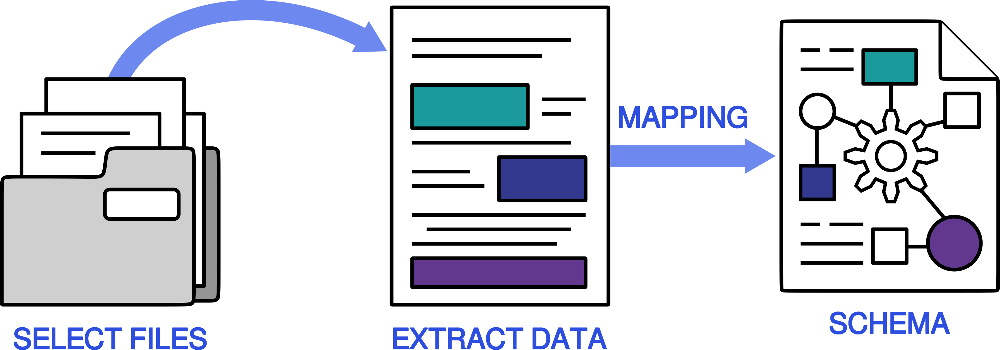

# Creating Parser Plugins from Scratch

One of NOMAD's most recognized features is drag-and-drop parsing.
The NOMAD parsers, which automate the conversion of raw simulation files into the standardized NOMAD format, significantly offload the burden of data annotation from researchers, reducing their data management responsibilities while also improving the accessibility of their data.

Behind the scenes, parsing means looking through the upload folder and selecting relevant files.
These files are then read in and their data extracted.
Lastly, the semantics of the file format are clarified and specified as its data is mapped into the NOMAD schema.
The data is now ready to interact with the NOMAD ecosystem and apps.

<div class="click-zoom">
    <label>
        <input type="checkbox">
        
    </label>
</div>

## Fundamentals of Parsing

As parsing involves the mapping between two well-defined formats, one could expect it to be trivial.
In practice, however, parser developers have to manage discrepancies in semantics, shape, data type or units.
This has lead to five distinct categories of responsibility for the developer to manage.
Here, they are ordered to match the parser's execution:

1. **file selection** - navigate the uploads folder structure and select the relevant files.
2. **source extraction** - read the files into Python. This step may already include some level of data field filtering.
3. **source to target** - map the data of interest with their counterparts in the target/NOMAD schema. This is where the bulk of the filtering happens.
4. **data mangling** - manipulate the data to match the target/NOMAD `Quantity`s' specification, e.g. dimensionality, shape. This may include computing derived properties not present in the original source files.
5. **archive construction** - build up a Python `EntryArchive` object using the classes provided by the target/NOMAD schema. NOMAD will automatically write it commit it to the database as an `archive.json`

Blurring these responsibilities leads to a wild-growth in parser design and added complexity, especially in larger, more feature-rich parsers.
NOMAD therefore offers powerful _tools_ and documentation on _best practices_ to help the parser developer manage each distinct responsibility.
The exact solutions are, in the same order:

1. `MatchingParser` - This class selects the file to be parsed. Since it interfaces with the NOMAD base directly, it will read in most of the settings automatically from there.
2. `XMLParser` and co. / `TextParser` - There are several _reader classes_ for loading common source formats into Python data types. Examples include the `XMLParser` and `HDF5Parser`. We will demonstrate `XMLParser` in [Parsing Hierarchical Tree Formats](#getting-the-data). Plain text files, meanwhile, involve an additional _matching step_ via the `TextParser`. More on this in [From Text to Hierarchies](#from-text-to-hierarchies).
3. `MappingAnnotationModel` - This is arguably the most involved part for the parser developer, as this is where the external data gets further semantically enriched and standardized. It requires domain expertise to understand the relationship between the data fields in the source file and the [NOMAD-Simulations schema](nomad_simulations.md). If step 2 went well, step 3 could just involve _annotating_ the target/NOMAD schema. We show how this is conceptually possible with `MappingAnnotationModel` in [Mapping a to Schema](#mapping-a-to-schema), but note that it still at the prototype stage.
4. [NOMAD-Simulations schema](nomad_simulations.md) / `MappingAnnotationModel` - The `MSection`s and `utils.py` in the schema provide _normalizers_ and _helper functions_ to alleviate most of the data mangling. For small amendments, use the mapping approach described in [Via Mapping](#via-mapping). For larger ones, consider extending the schema as covered in [Extending NOMAD-Simulations](schema_plugins.md).
5. `MetainfoParser` - this _converter_ bridges the annotated schema from step 3 with the reader classes in step 2. `MetainfoParser.data_object` contains the final `ArchiveSection` that is stored under `archive.data`.

In the next section, we will briefly illustrate how `MatchingParser`, `XMLParser`, and `MetainfoParser` interconnect, as well as flesh out some setup details.

## Starting a Plugin Project

To create your own parser plugin, visit our [plugin template](https://github.com/FAIRmat-NFDI/nomad-plugin-template) and click the “Use this template” button.
Follow the [How to get started with plugins](https://nomad-lab.eu/prod/v1/staging/docs/howto/plugins/plugins.html) documentation for detailed setup instructions.
The template will appear bare-bones at the start.
Following the instructions in the `README.md`  and the `cruft` setup will allow you to tune the project to your needs.

<div class="click-zoom">
    <label>
        <input type="checkbox">
        
    </label>
</div>

By the end, your repository should look like the example below.
Make sure to include both a `parsers` and a `schema_packages` folder.
Each file parser under `parsers` gets its own `.py` file.
For schemas, one file typically suffices, unless you want to heavily extend them (see [Extending NOMAD-Simulations](schema_plugins.md)).
Note that `myparser.py` and `mypackage.py` just act as a blueprints.
They should not be edited or exposed directly.

The `README.md` should remain a copy of the template, in case anyone wants to fork the project.
Instead, place plugin descriptions in the entry points or GitHub repository metadata.
More elaborate explanations should go under `docs`.
You can deploy them on GitHub or locally via `mkdocs`.
Lastly, NOMAD uses the Apache 2.0 license (option 4 in the `cruft` setup).
Please select the same license for maximal legal compatibility.
<!-- TODO remove explanation once resolved on template's end -->

```
├── nomad-plugin-parser
│   ├── src
|   │   ├── nomad_plugin_parser
|   |   │   ├── parsers
|   |   │   │   ├── myparser.py    (target functionality)
|   |   │   │   ├── __init__.py    (entry point)
|   |   │   ├── schema_packages
|   |   │   │   ├── mypackage.py
|   |   │   │   ├── __init__.py
│   ├── docs
│   ├── tests
│   ├── pyproject.toml             (publication specifications)
│   ├── LICENSE.txt
│   ├── README.md
---------------------------------------------------------------
├── nomad.yaml                     (NOMAD configurations)
```

This examples also highlights the files containing _entry point_ information between parentheses.
Entry points are the official mechanism for `pip` installing modules.
Just note that their referencing runs bottom up, i.e. from the `publication specifications` to the `entry point` itself, and from thereon to the `target functionality`.

The final piece in the entry point system, the `NOMAD configurations`, are external to plugin package.
The configurations refers back to the `publication specifications`.
It allows you to control the loading of plugins and their options, however, normally you don't have to touch anything there for NOMAD to pick up on your parser.

??? tip "Managing Entry Points"
    ### What are they?
    The plugin setup follows the common [entry-points](https://setuptools.pypa.io/en/latest/userguide/entry_point.html) Python standard from `importlib.metadata`.
    It works in tandem with `pip` install to allow for a more elegant and controlled way of exposing and loading (specific functionalities in) modules.
    Entry points also provide the module developer tools for controlling how it ought to be exposed to the environment, e.g. name, description, configuration.

    ### Relation with the Python Environment
    Contrary to regular dependencies, entry points are visible at a system-wide level, even when installed in a local environment.
    You can therefore choose whether to install plugins in their own environment, or construct a shared one (with the NOMAD base).
    We recommend the former to prevent dependency clashing.

    ### Key Players
    Conceptually, there are five roles to keep track off:

    - **target functionality**: the entity that we want to _expose_ to the NOMAD base installation. In our case, this will amount to our parser class, which typically is a child class of `MatchingParser`. It may use `configurations` parameters passed along via the nomad settings.
    - **entry point**: instance of `EntryPoint`, responsible for _registering_ the target functionality. It therefore also retains metadata like its name, a description and most importantly, the file matching directives. It is typically located in the `__init__.py` of the relevant functionality folder (see folder structure).
        - **entry point group**: bundles several entry points together. By default, NOMAD scans all plugins under the group name `project.entry-points.'nomad.plugin'`.
    - **publication specifications**: _exposes_ the entry point (and its group) under the format of `<module_name>.<object_name>:<entry_point_name>`. This is the name by which you should refer to it within the entry point system. For importing the within a Python script, use only `<module_name>.<object_name>`. In NOMAD we use the `pyproject.toml` setup file under the module's root folder.
    - **NOMAD configurations**: called in `nomad.yaml`, controls which entry points are _included_ or _excluded_, as well as their _configuration parameters_.

## Assembling a Parser Class

Throughout this subsection, we will provide a step-by-step guide of the process for building out a parser using the VASP XML output format as an example.
For an overview of the code in its complete form, you can check out the [official repository](https://github.com/FAIRmat-NFDI/nomad-parser-vasp/tree/older_alt).
Make sure to fork it in case you want to track your modifications.
The code snippets provided below should are located under `src/nomad_parser_vasp/parsers/`, in a file clarifying the intended extension, `xml_parser.py`.

### Hooking up a Parser

As denoted in step 1, the parser first has to read in the file contents as passed through by the NOMAD base.
The directives for selecting _mainfiles_ are passed on via an interaction cascade from `nomad.yaml` > `ParserEntryPoint` > `MatchingParser`.

??? note "What are mainfiles?"
    Mainfiles are files by which an expert / program can determine the code used / the parser to use.
    The selection directives (see below) target these files specifically.
    Their file paths are passed on to the parser, which can either process them or navigate the folder for other, auxiliary files.

#### Mainfile Matching

Since mainfiles are intrinsically connected to the scripts that parse them, the directives should be set via `ParserEntryPoint`.
In rare cases, however, an Oasis admin may decide to override these selection directives via the `nomad.yaml`.
We publish our VASP XML parser in `src/nomad_parser_vasp/parsers/__init__.py` as

```python
from nomad.config.models.plugins import ParserEntryPoint

class VasprunXMLEntryPoint(ParserEntryPoint):
    def load(self):
        from nomad_parser_vasp.parsers.xml_parser import VasprunXMLParser
        return VasprunXMLParser(**self.dict())

xml_entry_point = VasprunXMLEntryPoint(
    name='VasprunXML Parser',
    description='Parser for VASP output in XML format.',
    mainfile_name_re='.*vasprun\.xml.*',
)
```

`load()` comes from the entry point system and should just return our parser (see below).
The entry point itself specifies _parser data_ and the directives.
There are three kinds of file aspects that can be targeted, all via _regular expressions_ (regex):

- `mainfile_name_re` - the filename itself.
- `mainfile_contents_re`, `mainfile_contents_dict` - the file contents. It is by default restricted to the first 1024 bytes, i.e. the file header.
- `mainfile_mime_re` - the file mime.  <!-- TODO define file mime -->

??? abstract "Assignment 3.1"
    XML is a common file extension, and the user may remove `vasprun` from the name.
    Swap out `mainfile_name_re` for a different selection directive.
<!-- TODO research how multiple directives combine -->

??? success "Solution 3.1"
    VASP XML typically starts with the tags
    ```xml
    <?xml version="1.0" encoding="ISO-8859-1"?>
    <modeling>
    ```
    You can capture this via `mainfile_contents_re` in a regex like
    ```python
    r'<\?xml version="1\.0" encoding="ISO\-8859\-1"?>\n<modeling>
    ```
<!-- TODO double-check -->

#### Interfacing with NOMAD base

Within the cascade, `MatchingParser`, acts as the connection point on the parser side.
It plays less of a role in manipulating the directives, and more so in defining the _interface_ &mdash;a formalization of mutually agreed upon behavior&mdash; back to the parser.
The two main specifications are instantiation and `parse`.
Since `MatchingParser` already defines both, parsers may simply _inherit_ therefrom.
The most rudimentary parser, thus looks as follows:

```python
from nomad.parsing import MatchingParser
class VasprunXMLParser(MatchingParser):
    pass
```

??? tip "Running your Parser"
    ### Front-end
    In everyday NOMAD use, the user only interacts with NOMAD via the GUI or API.
    NOMAD will regulate parsing as the user uploads via these channels.

    ### Command-line
    During development, the command line is probably the preferable option, as you can load changes faster and incorporate it into your favorite test setups.
    To print the archive to the terminal, use `nomad parse --show-archive <mainfile>`.
    If you already know which parser to use, add the `--parser 'parser/<parser or entry point name>'` flag.
    To list all options, type `nomad parse --help`.
    Note that even the command line passes through the NOMAD base, so make sure to have it installed and set up correctly.

    ### Notebooks
    If you are using Jupyter Notebook, you can manipulate data in a head-on way without NOMAD base as an intermediary.
    Note that this entails providing the parsing input yourself, as well as manually triggering normalization.
    A template setup looks something like:

    ```python
    from nomad.datamodel import EntryArchive
    from nomad.client.processing import parse
    from nomad.client import normalize_all
    from nomad.normalizing.metainfo import MetainfoNormalizer
    from <parser_plugin>.parser import <ParserPlugin>

    p = ParserPlugin()
    a = EntryArchive()

    # parsing ONLY
    p.parse(<mainfile>, a, logger=None)

    # parsing + full normalization
    a = parse(<mainfile>)
    normalize_all(a[0])

    # parsing + schema-only normalization
    p.parse(<mainfile>, a, logger=None)
    MetainfoNormalizer().normalize(archive=a)
    ```

NOMAD can already run this parser, but will raise a `NotImplementedError`.
The interface may be defined, but we still need to fill in the actual parsing by overwriting the default `parse(...)` function.
That is for the next section.

### Getting the Data

Where `MatchingParser` provides a path to the mainfiles, a separate parser is needed for actually reading the _file contents_.
NOMAD already provides several parsers for popular, general-purpose formats like JSON, HDF5, and XML. <!-- TODO verify JSON -->
Plain text is also supported, but a bit more involved.
We cover it in section [From Text to Hierarchies](#from-text-to-hierarchies).

Contrary to `MatchingParser`, none of these parsers interface directly with the NOMAD base.
For example, they do not support the `parse(...)` function.
Therefore, our parser has to call `XMLParser`.
The typical strategy here is to save the _reader object_ for later manipulation.
In the example below, we read in the whole file.
The [XPath syntax](https://www.w3schools.com/xml/xpath_syntax.asp) also supports subbranch extraction, which can be incrementally added to the reader object. 

```python
from structlog.stdlib import BoundLogger
from nomad.datamodel.datamodel import EntryArchive
from nomad.parsing.file_parser.xml_parser import XMLParser

class VasprunXMLParser(MatchingParser):
    def parse(
        self, mainfile: str, archive: EntryArchive, logger: BoundLogger,
        child_archives: dict[str, EntryArchive] = None,
    ) -> None:
        xml_reader = XMLParser(mainfile=mainfile).parse('/*')  # XPath syntax
        archive.data = xml_reader._results
```
<!-- note that this XMLParser does not have a universal interface -->

??? note "To Return or not to Return"
    Should `parse(...)` return a filled out `EntryArchive` object to the NOMAD base or rather overwrite `archive`?
    Its _type signature_, i.e. `-> None`, denotes that it should in fact **not** return any output.

    In NOMAD, we use type signatures as much as possible.
    They are also tested in our CI/CD, which might request adding them in cases where types cannot be inferred.

The `NotImplementedError` is now resolved.
Running the parser results in a new error, however, `AttributeError: 'dict' object has no attribute 'm_parent'`.
This may look discouraging, but progress was made!
The data has been successfully extracted: check `xml_reader._results`.
The issue stems from data not yet meeting the high-quality standards of the NOMAD schema.
In the next section, we convert it.

??? info "What is the Archive?"
    An archive is a (typically empty) storage object for an entry.
    It is populated by the parser and later on serialized into an `archive.json` file by NOMAD for permanent storage.

    It has five sections, but for novel parsers we are solely interested in `data` and `workflow`.

    - `metainfo`: internal NOMAD metadata registering who uploaded the data and when is was uploaded. This is handled completely automatically by the NOMAD base.
    - `results`: the data indexed and ready to query at full database scale. It is automatically produced from `worfklow`, `data`, and `run`.
    - `workflow`: some entries coordinate other entries. This section coordinates the . For more, see [Interfacing complex simulations](custom_workflows.md).
    - `data`: the new section detailing all extracted values. It comes with the updated schema presented in [NOMAD-Simulations schema plugin](nomad_simulations.md).
    - `run`: the predecessor to `data`. It should only be targeted by legacy parsers, and has been marked for deprecation.

??? info "Communicating via Logs"

    Each entry has an associated log. <!-- Add screenshot GUI? -->
    These communicate info or warnings about the processing, as well as debugging info and (critical) errors for tracing bugs.
    Include the latter when contacting us regarding any processing issues.

    Here, we use the `logger` object to `info`rm which parser was called.

    ```python
    ...
    from nomad.config import config

    configuration = config.get_plugin_entry_point(
        'nomad_parser_vasp.parsers:xml_entry_point'
    )

    class VasprunXMLParser(MatchingParser):
        def parse(
            self, mainfile: str, archive: EntryArchive, logger: BoundLogger,
            child_archives: dict[str, EntryArchive] = None,
        ) -> None:

        logger.info('VasprunXMLParser.parse', parameter=configuration.parameter)
        ...
    ```

## From Parser back to NOMAD

We conceptualize format conversion as restructuring a _hierarchical data tree_, formally known as a _directed acyclic graph_.
A tree structure always starts at a common node, the _root_, where it splits of into several branches.
Each _node_ is a new potential splitting point.
When a _branch_ ends and no further splitting occurs, we call the node a _leaf_.
<!-- Bernadette suggested that not everyone may be familiar with the tree terminology. -->

The restructuring may then be defined in terms of lining up source with target nodes.
The only missing component then are the mappings themselves.

### Via Instantiation

There are two ways of populating the NOMAD schema.
The most basic one, on which you can always fall back, consists in _reconstructing_ it from the root down to the leaf nodes.
Given that the new NOMAD Simulations schema is quite shallow, this becomes more so a task in retrieving the section that best matches the semantics.
The tree representation in the example below could be understood as

```
      Simulation
      /       \
 Program      ModelSystem
  /   \           |
name version  AtomicCell
                  |
               positions
```

In the parser code itself, the sections and quantities are both just classes.
We thus construct a tree of their objects by _instantiating_ them one-by-one.

```python
from nomad.units import ureg
...

class VasprunXMLParser(MatchingParser):
    def parse(
        self,
        mainfile: str,
        archive: EntryArchive,
        logger: BoundLogger,
        child_archives: dict[str, EntryArchive] = None,
    ) -> None:
        xml_reader = XMLParser(mainfile=mainfile)

        def xml_get(path: str):
            return xml_reader.parse(path)._results[path]

        archive.data = Simulation(
            program=Program(
                name='VASP',
                version=xml_get("//generator/i[@name='version']")[0],
            ),
            model_system=ModelSystem(
                cell=AtomicCell(
                    positions=np.float64(xml_get("structure[@name='finalpos']/./varray[@name='positions']/v")[0]) * ureg.angstrom,
                ),
            ),
        )
```

??? warning "Data Type Conversion"
    NOMAD strictly enforces `Quantity` types like `np.int32`, `np.float64`, `np.complex128`, `str`, etc.
    These do no necessarily include all concepts from the `typing` or `numpy` module.
    `List`, for example, is controlled via the `Quantity.shape` attribute.

    Note that you should apply the proper type before storing the quantity value, as conversions that lead to loss of precision are returned as errors, e.g. `int` cannot be readily cast into `np.float64`.

The final `archive.json` will look something like the following.
Obviously, the exact values depend on the file parsed.

```JSON
{
  "data": {
    "m_def": "nomad_simulations.general.Simulation",
    "program": {
      "name": "VASP",
      "version": "5.3.2"
    },
    "model_system": [
      {
        "datetime": "2024-07-08T13:25:23.509517+00:00",
        "branch_depth": 0,
        "cell": [
          {
            "m_def": "nomad_simulations.model_system.AtomicCell",
            "name": "AtomicCell",
            "positions": [
              [
                0.0,
                0.0,
                0.0
              ],
              [
                0.500001,
                0.500001,
                0.500001
              ]
            ]
          }
        ]
      }
    ]
  },
  "metadata": {
    "entry_name": "vasprun.xml.relax",
    "mainfile": "/home/nathan/Downloads/vasprun.xml.relax",
    "text_search_contents": [
      "VASP",
      "[]",
      "AtomicCell"
    ],
    "domain": "dft",
    "n_quantities": 21,
    "quantities": [
      ...,
      "results.properties"
    ],
    "sections": [
      ...,
      "nomad_simulations.model_system.ModelSystem"
    ],
    "section_defs": [
      ...,
      {
        "id": "data.model_system.branch_depth#nomad_simulations.general.Simulation",
        "definition": "nomad_simulations.model_system.ModelSystem.branch_depth",
        "path_archive": "data.model_system.0.branch_depth",
        "int_value": 0
      }
    ]
  },
  "results": {
    "properties": {},
    "eln": {
      "sections": [
        "ModelSystem"
      ]
    }
  }
}
```

??? abstract "Assignment 3.2"
    `AtomicCell` should also contain information about the lattice vectors &mdash;reciprocal lattice vectors are derived&mdash; and periodic boundary conditions.
    Add these to the instantiation, knowing that the lattice vectors fall under `<structure><crystal><varray name="basis" >`.
    The boundary conditions, meanwhile, are always periodic in VASP.

??? success "Solution 3.2"
    The new `ModelSystem().cell` attribute now reads as:

    ```python
    ...
    cell=AtomicCell(
        positions=xml_get("structure[@name='finalpos']/./varray[@name='positions']/v")[0],
        lattice_vectors=xml_get("structure//varray[@name='basis']/v")[0],
        periodic_boundary_conditions=[True] * 3,
    )
    ```
    <!-- TODO double-check -->

This example shows a declarative approach to object instantiation:
any quantity/subsection listed under a section in the schema can be directly passed to the constructor.
Or course, the existence of section may be contingent on one and another.

If no `finalpos` are extracted &mdash;maybe due to a premature termination&mdash; neither should `model_system` be populated.
In this case, it is better to set the section attribute after constructing the main skeleton.

??? note "Updating the Getter"
    Given our modifications, `xml_get` should now also be in charge of failure signaling.
    Depending on the type expected, we may use `None` or `[]`.
    To prevent `IndexError` when extracting, we also pass the array `slice(...)` along as an argument.

```python
...

class VasprunXMLParser(MatchingParser):
    def parse(
    ...
    )
        ...
        def xml_get(path: str, slicer=slice(0, 1), fallback=None):
            try:
                return xml_reader.parse(path)._results[path][slicer]
            except KeyError:
                return fallback


        archive.data = Simulation(...)

        if (
            positions := xml_get(
                "structure[@name='finalpos']/./varray[@name='positions']/v",
                slice(None),
                fallback=np.array([]),
            )
        ).any():
            archive.data.model_system.append(
                ModelSystem(
                    cell=[AtomicCell(positions=np.float64(positions) * ureg.angstrom)]
                )
            )
```

Be mindful of the distinction between single/repeating sections, as they determine the interface, i.e. assignment/appending.
NOMAD will raise errors like `Exception has occurred: TypeError - Subsection model_method repeats, but no list was given`.

Another strategy is _success short-circuiting_, where code cycles through several trials until it encounters the first success.
An real-world use case is how VASP uses different tags to distinguish density functionals at varying rungs on Jacob's Ladder (that require other routines), e.g. `LSDA`, `GGA`, `METAGGA`.
PBE (`GGA` rung) is the defaults fall-back.

Since all NOMAD sections are convertible to `dict`, one can generate a `get` chain trying out the least likely examples up until the default value (`PE` in this case).

```python
...

class VasprunXMLParser(MatchingParser):
    ...
    convert_xc: dict[str, str] = {
        '--': 'GGA_XC_PBE',
        'PE': 'GGA_XC_PBE',
        ...
    }

    def parse(
    ...
    )
        ...

        archive.data = Simulation(
            model_method=[
                DFT(
                    xc_functionals=[
                        XCFunctional(
                            libxc_name=self.convert_xc.get(
                                xml_get(
                                    "///separator[@name='electronic exchange-correlation']/i[@name='LSDA']"
                                )[0],
                                {},
                            )
                            .get(
                                xml_get(
                                    "///separator[@name='electronic exchange-correlation']/i[@name='METAGGA']"
                                )[0],
                                {},
                            )
                            .get(
                                xml_get(
                                    "///separator[@name='electronic exchange-correlation']/i[@name='GGA']"
                                )[0],
                                'PE',
                            ),
                        ),
                    ],
                ),
            ],
        )
```

Lastly, if at any point you require a derived property for your parser logic, you can `normalize()` the section and extract it.
Just ensure to pass through the necessary information at the instantiation.
The NOMAD base will anyhow invoke normalization, so do not feel responsible for normalizing the entire archive.

??? warning "The Sense and Nonsense of Readers"
    In the examples above we fixated on the `XMLParser`, which really is more of a "reader", as it does not interface with NOMAD base directly.
    Instead, its only purpose is to make the file data accessible to Python.

    As such, a pragmatic attitude dictates that if you have more affinity for another reader, e.g. `lxml`, `BeautifulSoup`, `h5py` (demonstrated in the [Schema Plugin](schema_plugins.md) part), etc.
    Just mind the dependencies.
    Indeed, `XMLParser` itself is based on `ElementTree`, and just extends the reading into `dict`.
    Feel free to similarly add logic to your own readers above the parsing class.
    This sums up the legacy approach.

    Note that the alternative approach shown in [Mapping Annotations on the Schema side](#mapping-annotations-on-the-schema-side) does require specific NOMAD base converters for interacting with the NOMAD schema.

### Via Mapping

**DISCLAIMER: the code and functionalities covered in this section are still under construction and only serve as an illustration of the underlying concepts. Stay tuned for updates.**

The second option is to have the instantiation run automatically.
In that case, the mapping is added directly to our schema as an _annotation_.
Leveraging this enhanced schema requires some new readers, like `mapping_parser.XMLParser` for the XML side and `MetainfoParser` for the schema side.
The mapping is thus relegated to `schema_packages/vasp_schema.py`, leaving `parsers/xml_parser.py` as:

```python
from structlog.stdlib import BoundLogger
from nomad.datamodel.datamodel import EntryArchive
from nomad.config import config
from nomad.parsing import MatchingParser
from nomad.parsing.file_parser.mapping_parser import MetainfoParser, XMLParser
from nomad_parser_vasp.schema_packages.vasp_schema import Simulation

configuration = config.get_plugin_entry_point(
    'nomad_parser_vasp.parsers:xml_entry_point'
)

class VasprunXMLParser(MatchingParser):
    def parse(
        self, mainfile: str, archive: EntryArchive, logger: BoundLogger,
        child_archives: dict[str, EntryArchive] = None,
    ) -> None:
        ... #logging
        data_parser = MetainfoParser(annotation_key='xml', data_object=Simulation())
        XMLParser(filepath=mainfile).convert(data_parser)
        archive.data = data_parser.data_object
```

Look at the power of this technique: this is the full parser!
We only need to provide the root object, i.e. `Simulation`, from which to start the instantiation procedure.

### Mapping Annotations on the Schema side

**DISCLAIMER: the code and functionalities covered in this section are still under construction and only serve as an illustration of the underlying concepts. Stay tuned for updates.**

So how do the annotations to the schema look like?
Firstly, only attributes of `ArchiveSection`, i.e. `Quantity` (i.e. leaf nodes) or `SubSection` (i.e. branching nodes), have to be annotated.
Adding annotations is as simple as extending a dictionary: `<section_name>.<attribute_name>.m_annotations[<tag_name>] = MappingAnnotationModel(...)`.

The overall strategy is thus to annotate `path` mappings starting from `Simulation` and run over each `SubSection` up until reaching the corresponding `Quantity`.
The most important part is for the target/NOMAD path to be fully traceable:
any disconnections in a `path` will cut it out of the `archive`.

```python
from nomad_simulations.schema_packages.general import Simulation, Program
Simulation.m_def.m_annotations['xml'] = MappingAnnotationModel(path='modeling')
Simulation.program.m_annotations['xml'] = MappingAnnotationModel(path='.generator')
Program.name.m_annotations['xml'] = MappingAnnotationModel(path='.i[?"@name"="program"]')
```

Note how you can trace a continuous path down to `simulation.program.name`.
<!-- The advantage of annotating all in one place with keys, is that multiple mappings, from e.g. `.xml`, `hdf5`, become comparable at a glance. -->

## From Text to Hierarchies

When dealing with plain text, step 2 proceeds in two stages: reading in the file contents and making the `str` data more actionable in Python.
To this end, we construct an intermediate tree format where we will map into the schema from.

The tactic here is _weave_ two classes, `TextParser` and `Quantity`, both from `text_parser.py`, in with each other.
Always start with `TextParser` and use `Quantity.sub_parser` to go one level deeper.
To obtain finally obtain the tree as a Python `dict`, apply `TextParser.to_dict()` to the root node.

```python
txt_reader = TextParser(                # root node
    quantities = [                      # level 1
        Quantity(...),
        Quantity(...),
        Quantity(
            ...,
            sub_parser = TextParser(
                quantities = [          # level 2
                    Quantity(...),
                ]
            )
        ),
    ]
)
```

Note that the regex patterns should always contain _match groups_, i.e. `()`, else no text is extracted.
This is especially important for blocks, where the typical regex pattern has the form `r'<re_header>(?[\s\S]+)<re_footer>'` to match everything between the block header and footer.

??? note "Dissecting Tables"
    The typical approach to processing text tables is to match, in order:
    
    1. the table and extract (at least) the body.
    2. a standard line.
    3. the relevant column. <!-- TODO explore tools for when column semantics is tied to its index -->

    Ensure that you toggle the `Quantity.repeats: Union[bool, int]` option to obtain a list of matches.
    <!-- TODO how to extract as a matrix immediately (no dict keys) -- >

The main concern is how to leverage the additional freedom of a third format.
Our foremost advice is to:

1. follow the order in which the data normally appears.
2. use as similar as possible node names as in the file. If none are present, fall back on the NOMAD schema names.
3. systematically break down blocks of text via the weaving technique.
4. use the same node names when multiple versions exist. Maximize the common nodes and overall keep the alternatives as close as possible together.

<!-- Handling contingent values is more so reserved for step 3, mapping. -->
<!-- TODO add dynamic units example -->

??? info "Semantic Patterns"
    Modern text parsers come equipped with several common patterns to expedite the construction of complex patterns.
    Examples include `re_float` covering decimals and scientific notation, separators like `re_blank_line` or `re_eol`, and `re_non_greedy` for matching whole chunks of text, as shown above.
    The `capture(pattern)` function applies the match groups.
